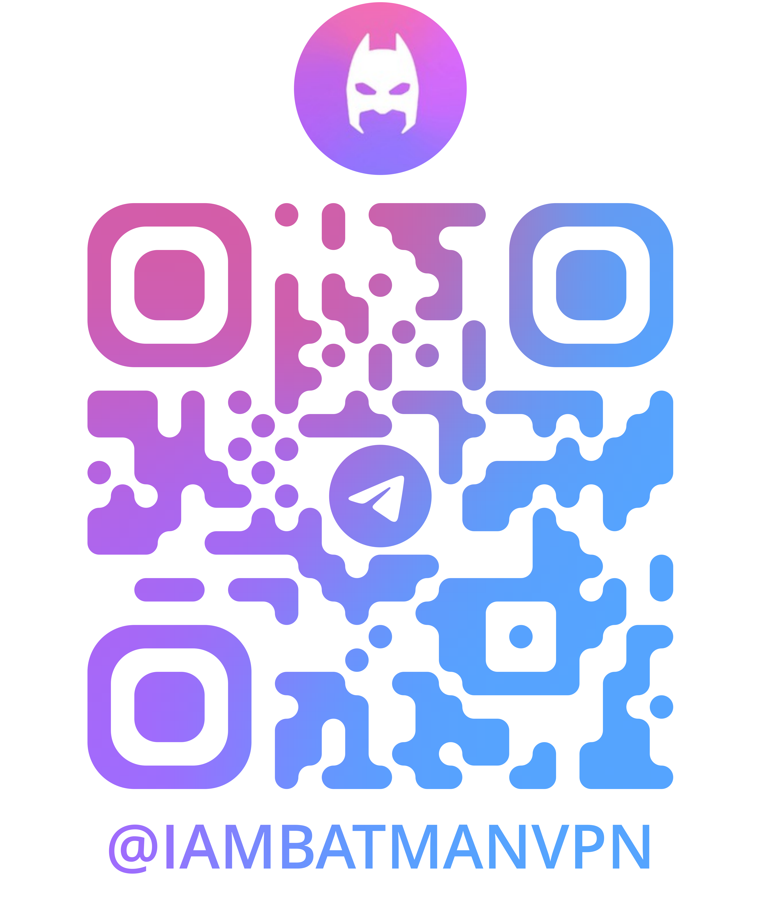

# FlashGo

本程序是由 SkyApp 开发的一整套VPN解决方案, 具有完整的客户端, 服务端, 以及配套的API服务和后台管理系统。

您无需担心技术和代码问题, 直接省去开发和技术成本, 我们具备15年以上网络工程开发经验, 可为您解决遇到的任何技术问题, 提供一站式VPN定制开发解决方案, 最快可一周内上线, 让您轻松运营自己的VPN服务.

## 在线体验

[FlashGo](https://flashgo.net)

## 客户端

- ✅ Windows
  Download: [FlashGo_latest.exe](https://pkgs.flashgo.net/client/FlashGo_latest.exe)

- ✅ macOS
  Download: [FlashGo_latest.dmg](https://pkgs.flashgo.net/client/FlashGo_latest.dmg)

- ✅ Linux
  Download: [FlashGo_latest.appimage](https://pkgs.flashgo.net/client/FlashGo_latest.appimage)

- ✅ Ubuntu
  Download: [FlashGo_latest.deb](https://pkgs.flashgo.net/client/FlashGo_latest.deb)

- ✅ Fedora
  Download: [FlashGo_latest.rpm](https://pkgs.flashgo.net/client/FlashGo_latest.rpm)

- ✅ Android
  Download: [FlashGo_latest.apk](https://pkgs.flashgo.net/client/FlashGo_latest.apk)

- ✅ Google Play
  [Download from Google Play](https://play.google.com/store/apps/details?id=app.flashgo.net)

- ✅ iOS
  [Download from App Store](https://apps.apple.com/us/app/flashgo/id1581440137000)

- ✅ Raspberry Pi
  Download: [FlashGo_latest.deb](https://pkgs.flashgo.net/client/FlashGo_latest.deb)

- ✅ OpenWRT
  Download: [FlashGo_latest.ipk](https://pkgs.flashgo.net/client/FlashGo_latest.ipk)

## 用户系统

基于流行的 `Next.js` 开发, 使用 `TypeScript` 和 `Tailwind CSS` 进行开发, 使用 `Shadcn UI` 作为组件库.

- ✅ 登录
- ✅ 注册
- ✅ 忘记密码
- ✅ 重置密码
- ✅ 修改密码
- ✅ 设备管理
- ✅ 套餐购买,支持自动订阅
- ✅ 订单管理
- ✅ 工单系统
- ✅ 配置同步管理
- ✅ 协议设置
- ✅ 路由设置
- ✅ 落地IP管理
- ✅ 加速设置
- ✅ 推广联盟
- ✅ 业绩查询
- ✅ 产品文档

## 后台管理系统

- ✅ 用户管理
- ✅ 管理员管理
- ✅ 节点管理
- ✅ 协议管理

## 节点服务程序

我们的节点程序整合了以下流行的内核, 并进行了优化和定制, 支持目前所有主流的协议, 包括 vless, vmess, trojan, shadowsocks, xtls, tuic, quic, hysteria2 等, 以满足您的需求.

- ✅ singbox
- ✅ xray-core
- ✅ clash
- ✅ v2ray-core
- ✅ 基于 iptables 的自动防护系统,可自动识别攻击流量并封禁

## 购买/续费/商业合作

**[Telegram](https://t.me/iambatmanvpn)**

{width=200px}
